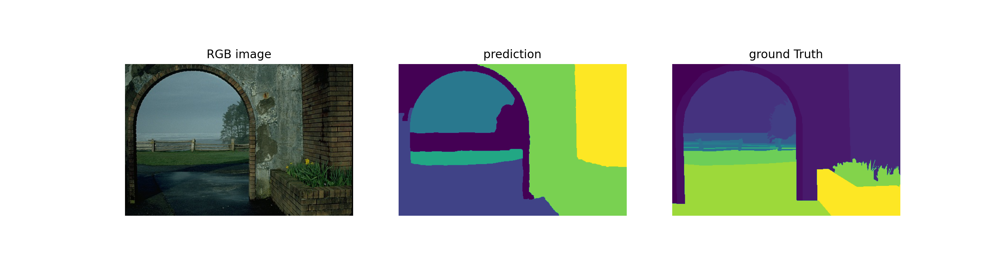
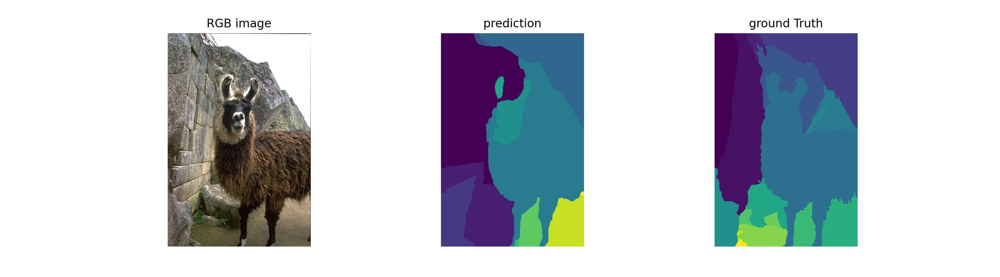

# BSD500-Segmentation-Evaluator
This repo is used to evaluate the results of segmentation with BSD500 dataset, including Probabilistic Rand Index (PRI), Variation of Information (VI) and Segmentation Covering (SC).

This repo provide the python code for calculating the PRI, VI and SC between a single prediction and groundTruth.

The python code is completed with reference to the matlab code which are provided by the BSD500 benchmark.

reference: [https://www2.eecs.berkeley.edu/Research/Projects/CS/vision/grouping/resources.html](https://www2.eecs.berkeley.edu/Research/Projects/CS/vision/grouping/resources.html)

## Dependencies
```
# Build a conda enviroment
conda create -n bsd-evaluation python=3.7
source activate bsd-evaluation
conda install numpy
pip install scipy tqdm scikit-image matplotlib
```


## Testing data






## Testing Example
```
cd python
python test_bench.py
```

## Results:
- mean SC is:  0.6355703654947689
- mean PRI is:  0.828961683464492
- mean VI is:  1.507315850885107
